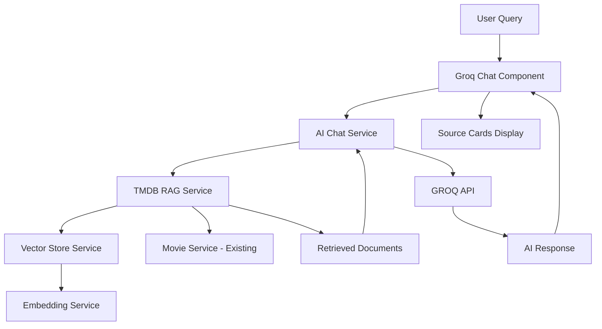

# Kế hoạch xây dựng AI Agent GROQ - TMDB RAG (1 ngày)

## Tổng quan

Xây dựng AI Agent sử dụng GROQ API, với RAG (Retrieval-Augmented Generation) chỉ dựa trên dữ liệu từ TMDB API để trả lời câu hỏi về phim và TV shows. Giao diện được thiết kế với Tailwind CSS và Ant Design.

## Kiến trúc tổng thể



## Buổi sáng: Setup & Core Infrastructure (4-5 giờ)

### 1. Cài đặt Dependencies (30 phút)

**Tasks:**

- Cài đặt Tailwind CSS và PostCSS
- Cài đặt Ant Design cho Angular (ng-zorro-antd)
- Cài đặt thư viện cho vector embeddings và search
- Cài đặt GROQ SDK hoặc AI/LLM SDK (GROQ API)

**Files cần tạo/cập nhật:**

- `package.json` - thêm dependencies
- `tailwind.config.js` - cấu hình Tailwind
- `postcss.config.js` - cấu hình PostCSS
- `angular.json` - cập nhật styles configuration

**Dependencies cần cài:**

```json
{
  "devDependencies": {
    "tailwindcss": "^3.x",
    "postcss": "^8.x",
    "autoprefixer": "^10.x"
  },
  "dependencies": {
    "ng-zorro-antd": "^19.x",
    "@ant-design/icons-angular": "^19.x",
    "ml-matrix": "^6.x",
    "groq-sdk": "^1.x"
  }
}
```

### 2. Cấu hình Tailwind CSS & Ant Design (45 phút)

**2.1. Setup Tailwind CSS:**

- Tạo `tailwind.config.js` với content paths cho Angular
- Cập nhật `src/styles.scss` để import Tailwind directives
- Cấu hình theme colors phù hợp với modern AI chat style

**2.2. Setup Ant Design:**

- Import Ant Design modules trong `app.config.ts`
- Cấu hình Ant Design theme (dark mode)
- Tạo shared configuration file

**Files:**

- `tailwind.config.js` - cấu hình Tailwind với paths: `src/**/*.{html,ts}`
- `postcss.config.js` - PostCSS config
- `src/styles.scss` - thêm `@tailwind base;`, `@tailwind components;`, `@tailwind utilities;`
- `src/app/app.config.ts` - import Ant Design providers
- `src/app/core/config/ant-design.config.ts` - Ant Design theme config

### 3. Tạo RAG Data Indexing Service (2 giờ)

**3.1. TMDB Data Collector Service:**

- Service để fetch và cache dữ liệu từ TMDB API
- Index movies, TV shows, genres, actors, keywords
- Tạo structured data format cho RAG documents
- Sử dụng existing `MovieService` và `TVShowService`

**3.2. Vector Embedding Service:**

- Tạo embeddings cho movie/TV show data (title, overview, genres, cast)
- Sử dụng simple TF-IDF hoặc text embeddings
- Store embeddings trong IndexedDB hoặc in-memory store

**3.3. RAG Retrieval Service:**

- Semantic search trong TMDB data
- Retrieve relevant movies/shows dựa trên user query
- Rank và filter results bằng cosine similarity
- Format retrieved documents thành context cho LLM

**Files:**

- `src/app/core/services/tmdb-rag.service.ts` - main RAG service
- `src/app/core/services/embedding.service.ts` - embedding generation
- `src/app/core/services/vector-store.service.ts` - vector storage & search
- `src/app/core/models/rag-document.model.ts` - RAG document interface

**Key methods:**

- `indexTMDBData()` - index movies/TV shows
- `search(query: string, limit: number)` - semantic search
- `getRelevantContext(query: string)` - retrieve context for LLM

### 4. AI Chat Service (1 giờ)

**4.1. Chat Service:**

- Integrate với GROQ API
- Format RAG context vào prompts
- Handle streaming responses
- Error handling và fallbacks

**4.2. Prompt Engineering:**

- Tạo system prompts chỉ dựa trên TMDB data
- Format context từ retrieved documents
- Handle edge cases (no results, ambiguous queries)

**Files:**

- `src/app/core/services/ai-chat.service.ts` - AI chat integration
- `src/app/core/prompts/system-prompts.ts` - prompt templates

**Key methods:**

- `chat(query: string, context: RAGDocument[])` - send query với context
- `streamChat(query: string, context: RAGDocument[])` - streaming response

## Buổi chiều: UI Components & Integration (4-5 giờ)

### 5. Tạo Groq Chat Component (2 giờ)

**5.1. Chat Interface:**

- Chat container với Ant Design components
- Message bubbles cho user và AI messages
- Input area với send button
- Loading states và typing indicators
- Chat history với scroll to bottom

**5.2. Styling với Tailwind:**

- Modern AI chat dark theme (`#0f0f0f` background, `#00d4ff` accent)
- Smooth animations cho messages
- Responsive design cho mobile

**Files:**

- `src/app/features/groq-chat/groq-chat.component.ts` - main component
- `src/app/features/groq-chat/groq-chat.component.html` - template
- `src/app/features/groq-chat/groq-chat.component.scss` - styles (kết hợp Tailwind)

**Components:**

- Message list với `@for` control flow
- Input form với Ant Design `nz-input` và `nz-button`
- Loading spinner với `nz-spin`

### 6. RAG Context Display (1 giờ)

**6.1. Source Cards:**

- Hiển thị movies/shows được sử dụng làm context
- Click để navigate đến movie/TV details
- Visual indicators cho relevance score
- Compact design không làm rối chat UI

**Files:**

- `src/app/features/groq-chat/components/source-card.component.ts`
- `src/app/features/groq-chat/components/source-card.component.html`
- `src/app/features/groq-chat/components/source-card.component.scss`

**Features:**

- Poster image thumbnail
- Title và release year
- Relevance indicator
- Click handler để navigate

### 7. Integration với Existing App (1 giờ)

**7.1. Routing:**

- Thêm route `/groq` hoặc `/ai-chat` vào `app.routes.ts`
- Lazy loading cho Groq chat module

**7.2. Navigation:**

- Thêm navigation link trong header hoặc sidebar
- Icon và label phù hợp

**7.3. Data Preloading:**

- Preload popular movies/shows vào RAG index khi app starts
- Background indexing không block UI
- Progress indicator nếu cần

**Files:**

- `src/app/app.routes.ts` - thêm route
- `src/app/features/header/header.component.ts` - thêm nav link
- `src/app/app.component.ts` - trigger preloading

### 8. Polish & Testing (1 giờ)

**8.1. Error Handling:**

- Handle API failures gracefully
- Fallback responses khi không tìm thấy data
- User-friendly error messages
- Retry logic cho failed requests

**8.2. Performance Optimization:**

- Optimize vector search với indexing
- Cache frequent queries
- Lazy load chat history
- Debounce search queries

**8.3. Final Styling:**

- Match modern AI chat aesthetic (dark theme, cyan accents)
- Smooth transitions và animations
- Mobile responsive
- Accessibility improvements

**Files:**

- Update tất cả components với error handling
- Add loading states
- Optimize performance

## Cấu trúc Files mới

```
src/app/
├── features/
│   └── groq-chat/
│       ├── groq-chat.component.ts
│       ├── groq-chat.component.html
│       ├── groq-chat.component.scss
│       └── components/
│           ├── message-bubble/
│           │   ├── message-bubble.component.ts
│           │   ├── message-bubble.component.html
│           │   └── message-bubble.component.scss
│           ├── source-card/
│           │   ├── source-card.component.ts
│           │   ├── source-card.component.html
│           │   └── source-card.component.scss
│           └── chat-input/
│               ├── chat-input.component.ts
│               ├── chat-input.component.html
│               └── chat-input.component.scss
├── core/
│   ├── services/
│   │   ├── tmdb-rag.service.ts
│   │   ├── embedding.service.ts
│   │   ├── vector-store.service.ts
│   │   └── ai-chat.service.ts
│   ├── models/
│   │   └── rag-document.model.ts
│   └── prompts/
│       └── system-prompts.ts
└── lib/
    └── components/
        └── groq-avatar/
            ├── groq-avatar.component.ts
            ├── groq-avatar.component.html
            └── groq-avatar.component.scss
```

## Technical Stack

**Frontend:**

- Angular 19 (existing)
- Tailwind CSS (new)
- Ant Design / ng-zorro-antd (new)
- RxJS (existing)

**RAG System:**

- In-memory vector store (simple implementation)
- TF-IDF hoặc simple text embeddings
- Cosine similarity cho semantic search
- IndexedDB cho persistence (optional)

**AI Integration:**

- GROQ API (sử dụng các models như Llama, Mixtral, etc.)

## Design Guidelines

**Modern AI Chat Theme:**

- Background: `#0f0f0f` hoặc `#1a1a1a`
- Accent color: `#00d4ff` (cyan)
- Text: `#ffffff` / `#e0e0e0`
- Rounded corners, smooth shadows
- Modern, minimal UI

**Ant Design Components:**

- `nz-card` cho message bubbles
- `nz-input` cho chat input
- `nz-button` với custom styling
- `nz-spin` cho loading states
- `nz-avatar` cho AI avatar
- `nz-empty` cho empty states

## Optimization Tips

1. **Lazy load RAG index**: chỉ index khi cần thiết
2. **Cache embeddings**: lưu vào IndexedDB để tránh recompute
3. **Debounce search**: giảm số lượng API calls
4. **Stream responses**: hiển thị từng từ để UX tốt hơn
5. **Prefetch popular data**: index sẵn top movies/shows khi app starts

## Constraints & Notes

- **RAG chỉ dựa trên TMDB data**: không sử dụng external knowledge base
- **Fallback strategy**: nếu không tìm thấy relevant data, trả lời dựa trên general TMDB info
- **Rate limiting**: tuân thủ TMDB API rate limits
- **Privacy**: không lưu user queries nếu không cần thiết
- **Cost optimization**: cache responses và limit API calls

## Quick Start Checklist

**Buổi sáng:**

- [ ] Cài đặt Tailwind CSS & Ant Design
- [ ] Setup configuration files
- [ ] Tạo TMDB RAG service
- [ ] Implement vector store service
- [ ] Tạo AI chat service với LLM integration

**Buổi chiều:**

- [ ] Build Groq chat UI component
- [ ] Integrate RAG với chat interface
- [ ] Add source cards component
- [ ] Setup routing & navigation
- [ ] Testing & final polish

## Timeline Estimate

- **Setup & Dependencies**: 1.25 giờ
- **RAG Services**: 3 giờ
- **UI Components**: 3 giờ
- **Integration & Polish**: 1.75 giờ
- **Total**: ~9 giờ (có thể hoàn thành trong 1 ngày với focus cao)