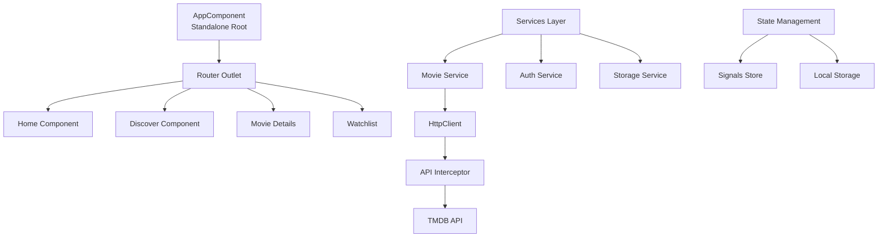

# Lộ trình học Angular 19 - Ứng dụng Phim TMDB (3 ngày)

## Tổng quan

Xây dựng ứng dụng phim hoàn chỉnh với TMDB API, học từng bước các tính năng mới của Angular 19, bao gồm Standalone Components, Signals, Control Flow, và các best practices.

## Kiến trúc tổng thể



## Ngày 1: Foundation & Core Features

### Buổi sáng: Setup & Migration

**1.1. Migration sang Standalone Components**

- Chuyển `AppComponent` sang standalone
- Tạo `app.config.ts` với `provideRouter`, `provideHttpClient`
- Cập nhật `main.ts` để bootstrap standalone app
- Files: `src/app/app.component.ts`, `src/app/app.config.ts`, `src/main.ts`

**1.2. Cấu hình Environment & API**

- Tạo `src/environments/environment.ts` cho TMDB API key
- Setup HTTP Interceptor để tự động thêm API key vào requests
- Files: `src/environments/environment.ts`, `src/app/core/interceptors/api.interceptor.ts`

**1.3. Tạo Core Services**

- `MovieService`: Quản lý API calls đến TMDB
- `StorageService`: Quản lý localStorage cho watchlist, favorites
- Files: `src/app/core/services/movie.service.ts`, `src/app/core/services/storage.service.ts`

### Buổi chiều: Routing & Navigation

**1.4. Cấu hình Routing**

- Setup routes: `/`, `/discover`, `/movie/:id`, `/watchlist`, `/top-rated`, `/celebrities`
- Tạo `RouterModule` với lazy loading
- Files: `src/app/app.routes.ts`

**1.5. Navigation Component**

- Chuyển `LeftSideComponent` sang standalone
- Implement navigation với `routerLink` và `routerLinkActive`
- Highlight active route
- Files: `src/app/export-result/left-side/left-side.component.ts`

**1.6. Home Component**

- Tạo Home page với featured movies
- Hiển thị popular movies từ TMDB
- Files: `src/app/pages/home/home.component.ts`

## Ngày 2: Advanced Features & Angular 19

### Buổi sáng: Signals & State Management

**2.1. Signals Store**

- Tạo signal-based store cho movie state
- Implement `computed()` cho derived state
- Files: `src/app/core/store/movie.store.ts`

**2.2. Discover Component với Signals**

- Search movies với debounce
- Filter by genre, year, rating
- Sử dụng `effect()` để sync với URL params
- Files: `src/app/export-result/discover/discover.component.ts`

**2.3. Movie Details Component**

- Dynamic route với `ActivatedRoute`
- Load movie details, cast, reviews
- Related movies suggestions
- Files: `src/app/pages/movie-details/movie-details.component.ts`

### Buổi chiều: Control Flow & Forms

**2.4. Angular 19 Control Flow**

- Thay thế `*ngIf`, `*ngFor` bằng `@if`, `@for`, `@switch`
- Sử dụng `@defer` cho lazy loading images
- Files: Tất cả components

**2.5. Reactive Forms**

- Search form với validation
- Filter form với multiple controls
- Custom validators
- Files: `src/app/shared/components/search-form/search-form.component.ts`

**2.6. Watchlist Feature**

- Add/remove movies từ watchlist
- Persist với localStorage
- Signal-based reactive updates
- Files: `src/app/export-result/watchlist/watchlist.component.ts`

## Ngày 3: Polish & Advanced Angular 19

### Buổi sáng: Performance & UX

**3.1. Image Optimization**

- Lazy loading với `@defer`
- Placeholder images
- Responsive images với TMDB image API
- Files: `src/app/shared/components/movie-card/movie-card.component.ts`

**3.2. Animations**

- Route transitions
- List animations với `@angular/animations`
- Loading skeletons
- Files: `src/app/animations/route.animations.ts`

**3.3. Loading States & Error Handling**

- Loading indicators với signals
- Error boundaries
- Retry mechanisms
- Files: `src/app/shared/components/loading/loading.component.ts`

### Buổi chiều: Advanced Features

**3.4. Guards & Resolvers**

- `CanActivate` guard cho protected routes
- Resolver để preload data
- Files: `src/app/core/guards/auth.guard.ts`, `src/app/core/resolvers/movie.resolver.ts`

**3.5. Pipes & Directives**

- Custom pipes: `duration`, `currency`, `date`
- Custom directives: `lazyLoad`, `clickOutside`
- Files: `src/app/shared/pipes/`, `src/app/shared/directives/`

**3.6. Top Rated & Celebrities**

- Top rated movies với pagination
- Celebrities list với infinite scroll
- Files: `src/app/export-result/top-rated/top-rated.component.ts`, `src/app/export-result/celebrities/celebrities.component.ts`

**3.7. Final Polish**

- Responsive design
- Accessibility improvements
- Performance optimization
- Code cleanup

## Cấu trúc thư mục đề xuất

```
src/app/
├── core/
│   ├── services/
│   │   ├── movie.service.ts
│   │   └── storage.service.ts
│   ├── interceptors/
│   │   └── api.interceptor.ts
│   ├── guards/
│   │   └── auth.guard.ts
│   ├── resolvers/
│   │   └── movie.resolver.ts
│   └── store/
│       └── movie.store.ts
├── pages/
│   ├── home/
│   ├── movie-details/
│   └── ...
├── shared/
│   ├── components/
│   │   ├── movie-card/
│   │   ├── search-form/
│   │   └── loading/
│   ├── pipes/
│   └── directives/
├── export-result/ (existing components)
└── app.config.ts
```

## Các tính năng Angular 19 sẽ học

1. **Standalone Components**: Không cần NgModule
2. **Signals**: Reactive state management
3. **Control Flow**: `@if`, `@for`, `@switch`, `@defer`
4. **New Lifecycle Hooks**: `afterRender`, `afterNextRender`
5. **Input Signals**: `input()`, `input.required()`
6. **Output as Observable**: `outputToObservable()`
7. **HttpClient với Signals**: Reactive data fetching
8. **provideRouter**: Functional router configuration

## TMDB API Endpoints sẽ sử dụng

- `GET /discover/movie` - Discover movies
- `GET /movie/{id}` - Movie details
- `GET /movie/{id}/credits` - Cast & crew
- `GET /movie/{id}/reviews` - Reviews
- `GET /movie/top_rated` - Top rated
- `GET /search/movie` - Search
- `GET /person/popular` - Popular celebrities
- `GET /genre/movie/list` - Genres

## Mục tiêu học tập

- Hiểu rõ Standalone Components architecture
- Thành thạo Signals và reactive programming
- Sử dụng Control Flow mới của Angular 19
- Implement routing với guards và resolvers
- Tối ưu performance với lazy loading
- Xây dựng ứng dụng production-ready
