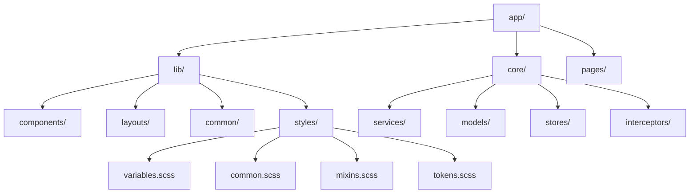

# Kế hoạch Refactor Project - 1 Ngày

## Tổng quan

Refactor project Angular dựa trên feedback để cải thiện cấu trúc, styling system, và tính tái sử dụng. Bao gồm:

1. Tổ chức lại cấu trúc theo dạng lib (components, layouts, services, common)
2. Thiết lập Design System với variables (colors, spacing, sizing, typography)
3. Tạo common style files
4. Chuyển tất cả CSS sang SCSS
5. Tối ưu state management (review stores)
6. Cải thiện tính tái sử dụng của components

## Kiến trúc mới



## Cấu trúc thư mục mới

```
src/app/
├── lib/
│   ├── components/          # Shared reusable components
│   │   ├── icon/
│   │   ├── movie-card/
│   │   ├── search-bar/
│   │   ├── filter-chip/
│   │   └── loading-spinner/
│   ├── layouts/             # Layout components
│   │   ├── main-layout/
│   │   └── sidebar-layout/
│   ├── common/              # Common utilities, pipes, directives
│   │   ├── pipes/
│   │   ├── directives/
│   │   └── utils/
│   └── styles/              # Global styles và design system
│       ├── _variables.scss
│       ├── _tokens.scss
│       ├── _mixins.scss
│       ├── _common.scss
│       └── _index.scss
├── core/                    # Giữ nguyên, đã tổ chức tốt
│   ├── services/
│   ├── models/
│   ├── stores/
│   └── interceptors/
├── pages/                   # Page-level components (feature modules)
│   ├── home/
│   ├── discover/
│   ├── movie-details/
│   ├── watchlist/
│   ├── top-rated/
│   └── celebrities/
└── export-result/           # Legacy - sẽ migrate dần
```

## Chi tiết implementation

### Phần 1: Thiết lập Design System (2-3 giờ)

#### 1.1. Tạo file variables cho Design System

- **File**: `src/app/lib/styles/_variables.scss`
- Định nghĩa variables cho:
  - **Colors**: primary, secondary, background, text, border, error, success, warning
  - **Spacing**: scale từ 4px đến 128px (4, 8, 12, 16, 24, 32, 48, 64, 96, 128)
  - **Sizing**: width/height scales
  - **Typography**: font-family, font-sizes, font-weights, line-heights
  - **Breakpoints**: mobile, tablet, desktop
  - **Borders**: radius, width
  - **Shadows**: elevation levels
  - **Transitions**: durations, easings

#### 1.2. Tạo file tokens (tái cấu trúc tokens.scss hiện tại)

- **File**: `src/app/lib/styles/_tokens.scss`
- Import và sử dụng variables từ `_variables.scss`
- Định nghĩa semantic tokens (ví dụ: `$color-primary` thay vì `$a-00-b-9-ae-color`)
- Group tokens theo categories: colors, spacing, typography, etc.

#### 1.3. Tạo mixins cho common patterns

- **File**: `src/app/lib/styles/_mixins.scss`
- Tạo mixins cho:
  - Responsive breakpoints
  - Flexbox utilities
  - Text truncation
  - Button styles
  - Card styles
  - Transitions

#### 1.4. Tạo common styles

- **File**: `src/app/lib/styles/_common.scss`
- Định nghĩa global utilities:
  - Reset styles
  - Common classes (.container, .flex, .grid, etc.)
  - Typography classes
  - Spacing utilities

#### 1.5. Tạo index file để export tất cả

- **File**: `src/app/lib/styles/_index.scss`
- Import và export tất cả style files
- Components sẽ import từ file này

### Phần 2: Restructure Project (3-4 giờ)

#### 2.1. Tạo cấu trúc lib mới

- Tạo thư mục `src/app/lib/` với các subfolders
- Di chuyển các shared components vào `lib/components/`:
  - `export-result/icon/` → `lib/components/icon/`
  - Tạo `lib/components/movie-card/` (extract từ các components đang duplicate logic)

#### 2.2. Tổ chức layouts

- **File**: `src/app/lib/layouts/main-layout/`
- Extract layout logic từ `app.component` và `main-content.component`
- Tạo `MainLayoutComponent` để wrap các pages

#### 2.3. Reorganize pages

- Di chuyển các page components vào `pages/`:
  - `export-result/home/` → `pages/home/`
  - `export-result/discover/` → `pages/discover/`
  - `export-result/watchlist/` → `pages/watchlist/`
  - `export-result/movie-details/` → `pages/movie-details/`
  - `export-result/tv-details/` → `pages/tv-details/`
  - `export-result/top-rated/` → `pages/top-rated/`
  - `export-result/celebrities/` → `pages/celebrities/`

#### 2.4. Giữ layouts trong export-result nhưng tái tổ chức

- `export-result/left-side/` → `lib/layouts/sidebar/` (hoặc giữ nguyên nhưng update imports)
- `export-result/header/` → `lib/layouts/header/`
- `export-result/main-content/` → `lib/layouts/main-content/` hoặc merge vào `main-layout`

### Phần 3: Convert CSS sang SCSS (1-2 giờ)

#### 3.1. Convert các file CSS còn lại

- `app.component.css` → `app.component.scss`
- `error.component.css` → `error.component.scss`
- `home.component.css` → `home.component.scss`
- `movie-details.component.css` → `movie-details.component.scss`
- `tv-details.component.css` → `tv-details.component.scss`

#### 3.2. Update imports trong components

- Thay đổi `styleUrls` từ `.css` sang `.scss`
- Import design system variables vào mỗi component SCSS

#### 3.3. Refactor component styles để sử dụng variables

- Thay hardcoded values bằng variables từ design system
- Sử dụng mixins cho common patterns
- Loại bỏ duplicate styles

### Phần 4: Cải thiện Reusability (2-3 giờ)

#### 4.1. Extract Movie Card component

- **File**: `src/app/lib/components/movie-card/movie-card.component.ts`
- Tạo reusable `MovieCardComponent` với Inputs:
  - `movie: Movie | TVShow`
  - `showRating?: boolean`
  - `size?: 'small' | 'medium' | 'large'`
- Logic hiện tại được duplicate trong nhiều components sẽ được centralize

#### 4.2. Extract Search Bar component

- **File**: `src/app/lib/components/search-bar/search-bar.component.ts`
- Tạo `SearchBarComponent` reusable với:
  - Debounce logic
  - Customizable placeholder
  - Clear button

#### 4.3. Extract Filter components

- Tạo `FilterChipComponent` cho genre/year filters
- Tạo `RatingSliderComponent` cho rating filter
- Tạo `YearSelectComponent` cho year dropdown

#### 4.4. Tạo common utilities và pipes

- **File**: `src/app/lib/common/utils/`
- Extract utility functions (getImageUrl, formatDate, etc.)
- Tạo pipes: `ImageUrlPipe`, `YearPipe`, `RatingPipe`

### Phần 5: Review và Optimize State Management (1 giờ)

#### 5.1. Review stores

- Xem xét `MovieStore` và `TVShowStore`
- Vì signals đã là state, xem xét việc simplify stores
- Có thể giữ stores nhưng chỉ để organize signals, không cần complex logic

#### 5.2. Document state management pattern

- Tạo document về cách sử dụng signals trong stores
- Đảm bảo consistent pattern across stores

### Phần 6: Update Imports và Configuration (1 giờ)

#### 6.1. Update tất cả imports

- Update import paths trong tất cả components
- Update routing trong `app.routes.ts`
- Update component declarations

#### 6.2. Update angular.json

- Update `stylePreprocessorOptions` nếu cần
- Đảm bảo SCSS compilation hoạt động đúng

#### 6.3. Update styles.css

- Import design system vào `src/styles.css` (hoặc đổi thành `styles.scss`)
- Global styles sẽ import từ `lib/styles/_index.scss`

### Phần 7: Testing và Polish (1 giờ)

#### 7.1. Test application

- Chạy `ng serve` và kiểm tra tất cả pages
- Verify styling đúng
- Fix broken imports

#### 7.2. Cleanup

- Xóa các file không sử dụng
- Remove duplicate code
- Update README nếu cần

## Files cần tạo mới

1. `src/app/lib/styles/_variables.scss` - Design system variables
2. `src/app/lib/styles/_tokens.scss` - Semantic tokens
3. `src/app/lib/styles/_mixins.scss` - SCSS mixins
4. `src/app/lib/styles/_common.scss` - Common utility classes
5. `src/app/lib/styles/_index.scss` - Style exports
6. `src/app/lib/components/movie-card/movie-card.component.*` - Reusable movie card
7. `src/app/lib/components/search-bar/search-bar.component.*` - Reusable search bar
8. `src/app/lib/components/filter-chip/filter-chip.component.*` - Filter chip component
9. `src/app/lib/common/utils/` - Utility functions
10. `src/app/lib/common/pipes/` - Custom pipes

## Files cần migrate

1. `src/app/tokens.scss` → `src/app/lib/styles/_tokens.scss` (refactor)
2. `src/app/export-result/icon/` → `src/app/lib/components/icon/`
3. `src/app/export-result/home/` → `src/app/pages/home/`
4. `src/app/export-result/discover/` → `src/app/pages/discover/`
5. `src/app/export-result/watchlist/` → `src/app/pages/watchlist/`
6. Tất cả `.css` files → `.scss` và refactor để dùng variables

## Lưu ý quan trọng

1. **Giữ backward compatibility**: Đảm bảo không break existing functionality khi refactor
2. **Incremental migration**: Có thể giữ `export-result/` và migrate dần dần
3. **Design System**: Tạo một file tổng để define style - khi đổi màu trong file đó thì cả app đổi theo
4. **Reusability**: Components và functions phải reusable nhất có thể
5. **No UI Library**: Không cần install UI library mới, chỉ chuẩn bị structure để có thể integrate sau

## Timeline ước tính

- *